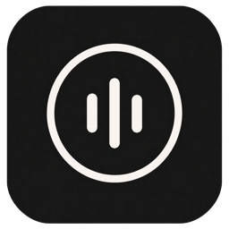

# Reco

<p align="center">
  
</p>

Reco is a minimal macOS menu bar dictation app. Hold a configurable global shortcut to record, release it to transcribe, and Reco copies and pastes the result into the active app. Double-tap the shortcut to latch recording on, then press it once to stop.

Transcription runs locally with NVIDIA Parakeet TDT 0.6B v3 through FluidAudio and Core ML. The model is downloaded from Hugging Face on first launch; after that download, recorded audio is processed on-device. Temporary recordings are deleted after transcription.

## Download

Download the signed and notarized macOS app from the [GitHub Releases page](https://github.com/danielcorin/Reco/releases).

## Why

I built this because I wanted an open source, open weights, minimal, hotkey-based transcription app that wasn't bloated, prone to frequent breaking, bound to a cloud provider, or trying to upsell me. At least if this one breaks, it's my fault and I can fix it on my terms.

## AI disclosure

I made Reco using a few different coding agent tools and LLMs.

## Requirements

- macOS 14 or later
- Xcode with Swift 6 support
- An Apple Silicon Mac is recommended for Core ML performance
- Microphone and Accessibility permissions

## Build

1. Clone the repository and open `Reco.xcodeproj`.
2. Copy `Configuration/Local.xcconfig.example` to `Configuration/Local.xcconfig`.
3. Set `DEVELOPMENT_TEAM` to your Apple Developer Team ID and choose a unique `PRODUCT_BUNDLE_IDENTIFIER`.
4. Select the Reco scheme and run the app.

`Local.xcconfig` is ignored by Git so developer account details do not become part of the project. An unsigned command-line build can be run with:

```sh
xcodebuild \
  -project Reco.xcodeproj \
  -scheme Reco \
  -destination 'platform=macOS' \
  CODE_SIGNING_ALLOWED=NO \
  build
```

## Publishing a release

The release script reads the version, build number, and bundle ID from the resolved Xcode settings. It prefers signing details from the release environment and falls back to the ignored `Configuration/Local.xcconfig`; no real Apple team ID or credentials are stored in the repository.

Copy the release environment template, fill in your Apple credentials and repository, then allow direnv:

```sh
cp .env.example .env
direnv allow
```

The ignored `.env` uses `APPLE_ID`, `APPLE_ID_PASSWORD`, `DEVELOPER_ID_APPLICATION`, and `TEAM_ID`. On the first release, the script validates those values and stores the [app-specific password](https://support.apple.com/102654) in the `RecoNotary` Keychain profile. Later releases reuse the Keychain profile. `NOTARY_PROFILE` defaults to `RecoNotary`, and the older `NOTARY_APPLE_ID`, `DEVELOPER_IDENTITY`, and `DEVELOPMENT_TEAM` names remain supported.

Before each release, update `MARKETING_VERSION` and `CURRENT_PROJECT_VERSION` in Xcode, then commit and push those changes. Run the full release with:

```sh
scripts/publish-release.sh --publish
```

That command requires a clean branch synchronized with its upstream, creates a universal archive, uploads it through the Xcode account configured on the Mac, waits for Apple notarization, exports and verifies the stapled app, creates the ZIP and DMG, separately notarizes the outer DMG, verifies checksums, and creates the GitHub Release. Use `--dry-run` to inspect the resolved plan or pass an existing notarized `.app` path to skip the archive and app-notarization stages. `--skip-dmg-notarization` is available only as an explicit exception and is not recommended for public releases.

## Permissions and privacy

Reco registers only the configured global shortcut through the macOS hotkey API; it does not monitor unrelated keyboard input. The app is not sandboxed because it synthesizes Command-V to insert transcribed text. macOS Accessibility consent provides the user control for that event posting.

Audio is recorded to a randomly named temporary file, transcribed locally, and deleted when transcription completes. Reco does not send recordings to a transcription service. Network access is required on first use to download the model artifacts from Hugging Face.

## Model and dependency licenses

- Reco source: [Apache License 2.0](LICENSE).
- [FluidAudio 0.15.5](https://github.com/FluidInference/FluidAudio/tree/v0.15.5): Apache-2.0. FluidAudio includes Fastcluster code under BSD-2-Clause and code based on VBx under Apache-2.0.
- [FluidInference/parakeet-tdt-0.6b-v3-coreml](https://huggingface.co/FluidInference/parakeet-tdt-0.6b-v3-coreml): treated as CC BY 4.0, matching the repository metadata and its NVIDIA base model. The weights are downloaded at runtime and are not included in this repository.

The converted model repository's metadata and NVIDIA base model specify CC BY 4.0, although a sentence in the converted model card says Apache-2.0. Reco conservatively follows CC BY 4.0. Distributors that bundle or mirror the weights should retain attribution and seek clarification from Fluid Inference.

See [THIRD_PARTY_NOTICES.md](THIRD_PARTY_NOTICES.md) for the complete notices included with binary distributions.

## Contributing and security

Contributions are welcome; see [CONTRIBUTING.md](CONTRIBUTING.md). Please report security issues privately to the repository owner rather than opening a public issue.

## License

Licensed under the Apache License, Version 2.0. See [LICENSE](LICENSE).
